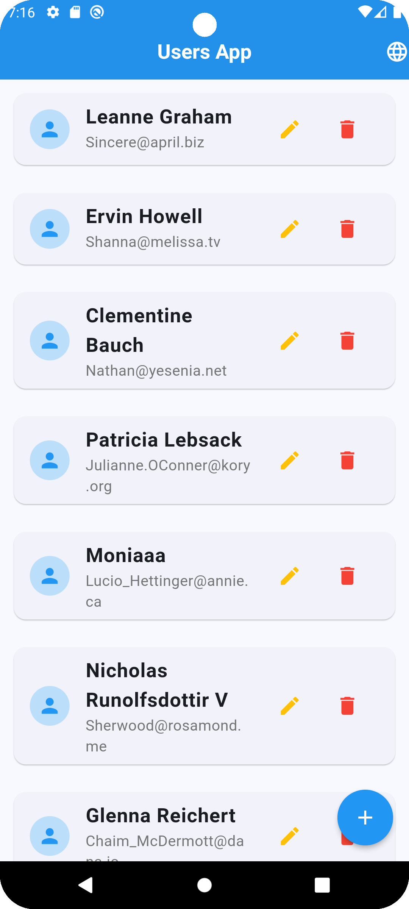
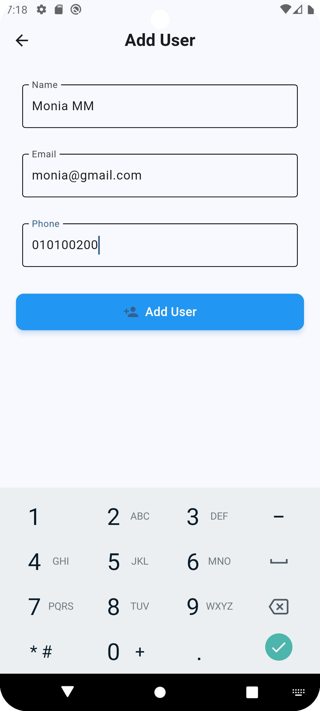
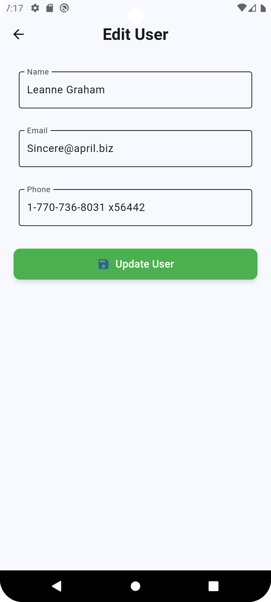
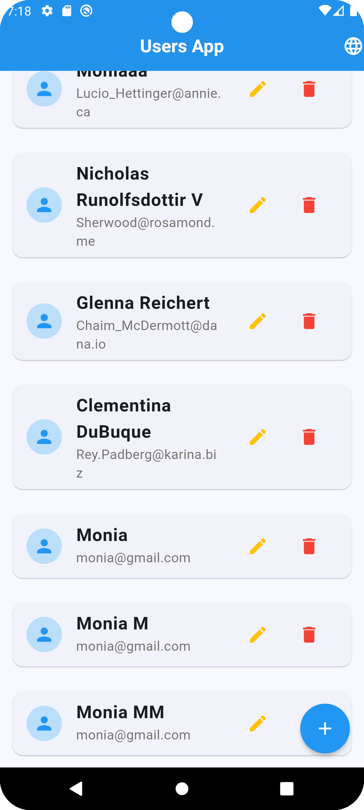
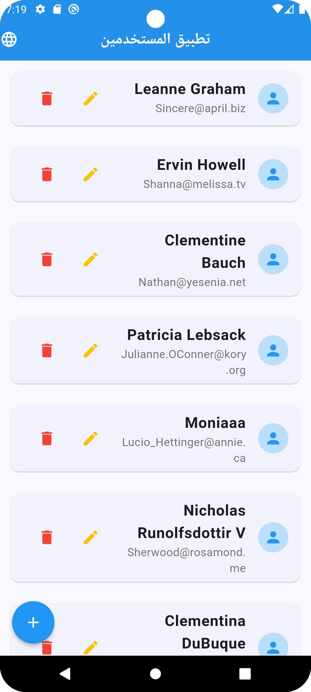
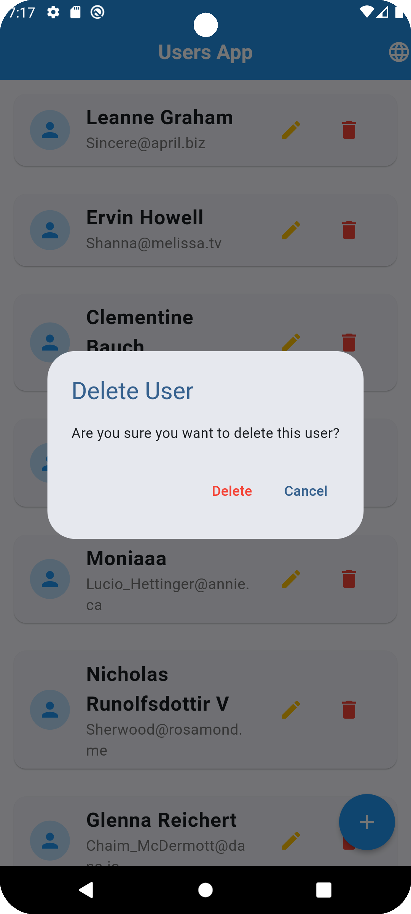
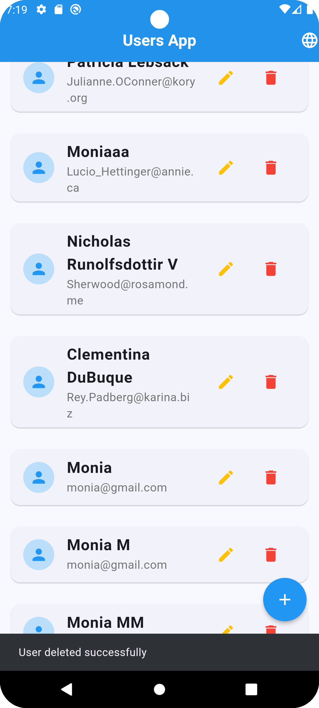

# Users Management App

This application is a Flutter-based solution for managing a list of users. It provides functionality
to add, update, and delete users, along with localized support for English and Arabic.

---

## Features

1. **View Users**:
    - Displays a list of users with their name, email, and phone number.
2. **Add User**:
    - Users can add a new user by providing name, email, and phone.
3. **Edit User**:
    - Allows modification of existing user details.
4. **Delete User**:
    - Removes a user from the list.
5. **Localization**:
    - Supports multiple languages (English and Arabic).
6. **Local Caching**:
    - Saves user data locally using a caching service (`UserService`).

---

## Project Structure

### 1. **Screens**

- **`UsersProfile`**:
    - Main screen displaying the list of users.
    - Includes functionality to add, update, and delete users.
- **`AddUser`**:
    - A screen for adding new users.
- **`EditUserPage`**:
    - A screen for editing an existing user's details.

### 2. **Widgets**

- **`UserCard`**:
    - Represents individual users in the list.
    - Includes actions for editing and deleting users.
- **Custom Widgets** (e.g., `CustomButton`, `CustomTextField`):
    - Reusable widgets for UI consistency.

### 3. **Services**

- **`UserService`**:
    - Handles loading and saving users from/to local storage.

### 4. **Models**

- **`UserModel`**:
    - Defines the structure of a user object with fields: `id`, `name`, `email`, `phone`.

### 4. **Data**

- **`DataHandling`**:
    - Cached data in local storage.

---

## How It Works

### **Data Flow**

1. **UsersProfile**:
    - Fetches user data from `UserService`.
    - Manages the list of users and their updates.
2. **AddUser**:
    - Accepts user input for a new user and returns the data to `UsersProfile`.
3. **EditUserPage**:
    - Updates an existing user's data and sends it back to `UsersProfile`.
4. **UserService**:
    - Ensures data persistence by caching the user list locally.

### **Localization**

- Uses `flutter_gen` for managing localized strings.
- Allows users to toggle between English and Arabic from the main screen.

---

## Dependencies

- **Flutter SDK**: Version 3.x or later.
- **Dio**: For handling HTTP requests and data caching.
- **flutter_gen**: For generating localized resources.
- **shared_preferences**: For caching data locally.

---

## Screenshots

| Fetch Date                   | Add             | Update                | New Users                   | Localization                      |
|------------------------------|-----------------|-----------------------|-----------------------------|-----------------------------------|
|  |  |  |  |  |

| Delete                | Delete Message                        |
|-----------------------|---------------------------------------|
|  |  |

---

